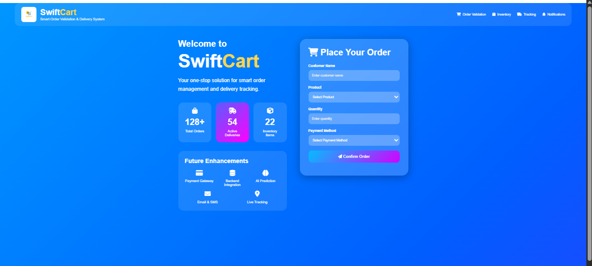
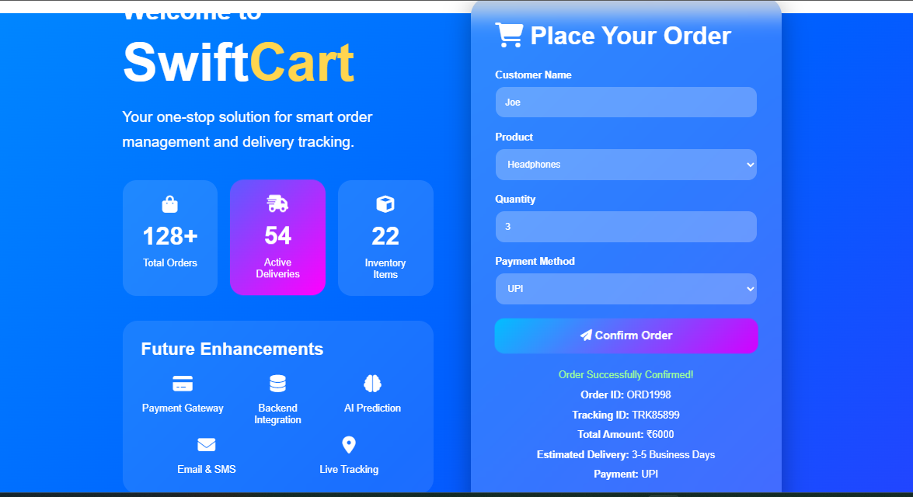
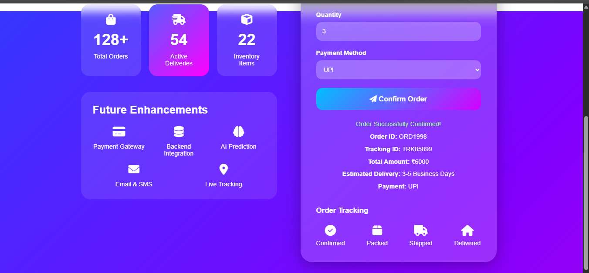
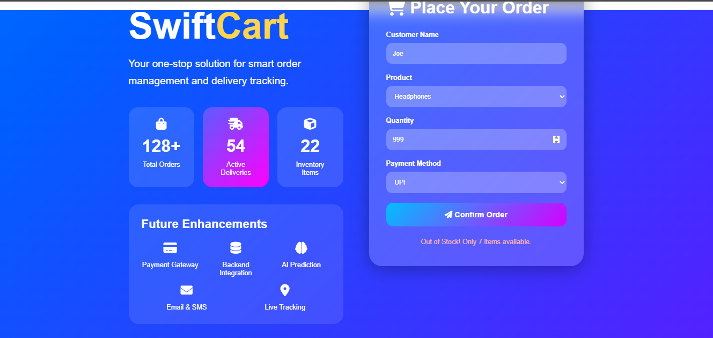

# SwiftCart Order Management System

## Overview

SwiftCart is a frontend-based ecommerce Order-to-Delivery workflow simulation project developed as part of an internship assignment for Biztab Consulting Services.

The project demonstrates a complete ecommerce workflow including:

* Order Validation
* Inventory Checking
* Payment Processing
* Delivery Tracking
* Order Confirmation
* Error Handling

The system is designed using a modern glassmorphism-inspired UI with interactive frontend functionality and business workflow simulation.

---

# Live Website

🔗 [Visit SwiftCart Live Website](https://scarletsiren50-art.github.io/swiftcart-order-management-system/)

---

# Project Documents

## Presentation PPT

📄 [View Presentation](docs/SwiftCart%20Order%20Management%20System.pptx)

## Business Flow Diagram

🖼️ [View Business Flow Diagram](docs/BusinessFlow.png)

---

# Project Features

## Core Functionalities

* Customer Order Validation
* Inventory Availability Check
* Payment Method Selection
* Order & Tracking ID Generation
* Delivery Progress Simulation
* Notification Popup Alerts
* Loading Animation
* Error Handling for Out-of-Stock Products

---

## UI/UX Features

* Modern Glassmorphism Design
* Animated Gradient Background
* Interactive Dashboard Statistics
* Responsive Layout
* Animated Tracking Workflow
* Hover Effects & Transitions
* Ecommerce Inspired Interface

---

# Technologies Used

## Frontend Technologies

* HTML5
* CSS3
* JavaScript

## Design & Development Tools

* Font Awesome
* Draw.io
* Canva
* VS Code
* GitHub Pages

---

# Business Workflow

The SwiftCart system follows a simplified Order-to-Delivery lifecycle:

1. Customer Places Order
2. Order Validation
3. Inventory / Stock Check
4. Payment Processing
5. Order Confirmation
6. Warehouse Packing
7. Shipment Initiation
8. Logistics Transportation
9. Delivery Tracking
10. Final Delivery Confirmation

---

# Project Structure

```text
swiftcart-order-management-system/
│
├── README.md
│
├── index.html
├── style.css
├── script.js
│
├── assets/
│   └── logo.png
│
├── docs/
│   ├── Presentation.pptx
│   └── BusinessFlow.png
│
└── screenshots/
```

---

# Screenshots

## Homepage UI



---

## Order Confirmation



---

## Delivery Tracking



---

## Inventory Validation Error



---

# Future Enhancements

Potential future improvements include:

* Real Payment Gateway Integration
* Backend Database Connectivity
* Warehouse Management System
* AI-Based Demand Prediction
* Live Logistics Tracking
* Email & SMS Notifications
* Customer Authentication
* Admin Dashboard
* Cloud Deployment

---

# Learning Outcomes

This project helped improve understanding of:

* Ecommerce business workflows
* Frontend UI/UX implementation
* Inventory validation logic
* Delivery tracking simulation
* Business process automation
* Interactive dashboard development

---

# Developed By

### Md. Sadiya Tabassum

The ICFAI Foundation for Higher Education, IFHE, Hyderabad

Internship Assignment Submission
Biztab Consulting Services
